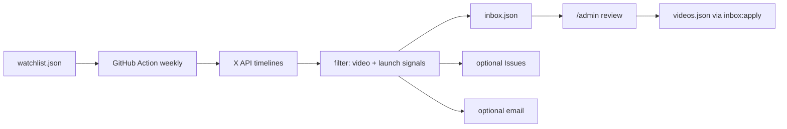

# whatships.com

A curated directory of startup launch videos, demos, and walkthroughs shared on X/Twitter — live at [whatships.com](https://whatships.com).

## Local development

```bash
pnpm install
pnpm dev
```

Open [http://localhost:4321](http://localhost:4321).

## Scripts

| Command | Description |
| --- | --- |
| `pnpm dev` | Start the Astro dev server |
| `pnpm build` | Production static build (fetches X oEmbed at build time) |
| `pnpm deploy` | Build, strip local streams, and deploy to Cloudflare Workers |
| `pnpm preview` | Preview the production build |
| `pnpm check` | Astro + TypeScript check |
| `pnpm test:run` | Unit tests (Vitest) |
| `pnpm posters:capture` | Download amplify MP4s and extract 1440w + 960w posters (streams are no longer generated) |
| `pnpm discovery:dry-run` | Scan X watchlist (needs `X_BEARER_TOKEN`) and print candidates without filing issues |
| `pnpm discovery:fixture` | Run discovery against the sample fixture (no API key) |
| `pnpm discovery:seed-inbox` | Seed `src/data/inbox.json` from the fixture (for `/admin` demos) |
| `pnpm discovery -- --publish --email` | Create GitHub issues, update inbox, optional Resend digest |
| `pnpm inbox:apply` | Merge **approved** inbox drafts into `videos.json` |

## Deployment

Every push to `main` triggers [`.github/workflows/deploy.yml`](.github/workflows/deploy.yml): build → strip `dist/streams` → `wrangler deploy` to Cloudflare Workers static assets, served on `whatships.com` and `www.whatships.com`.

In-site playback goes through a self-hosted video proxy ([`workers/video-proxy`](workers/video-proxy)) at `proxy.whatships.com`: X's CDN rejects any non-Twitter Referer, so the Worker relays the original `video.twimg.com` media Referer-less. Local `/streams/{slug}.mp4` files are a dev-only fallback and stay out of git.

Required secrets / env:

| Secret / env | Where | Purpose |
| --- | --- | --- |
| `CLOUDFLARE_API_TOKEN` | GitHub Actions secret | `wrangler deploy` |
| `PUBLIC_VIDEO_PROXY_BASE` | Build env | Playback proxy base URL inlined into the bundle |

## Adding curated videos

Edit `src/data/videos.json`. Each published entry needs:

- stable `slug` and `id`
- product/company metadata
- `category` from the allowed list in `src/lib/catalog.ts`
- `tweetUrl` / `tweetId` for the original X post
- `videoUrl` (amplify MP4) — used for poster capture and proxied playback
- `poster` path under `public/posters/`
- `status: "published"` (drafts stay offline)

After adding a `videoUrl`, capture the poster:

```bash
pnpm posters:capture -- --slug=your-slug --force
```

Detail pages embed the original post via X's oEmbed API during `pnpm build`. If oEmbed fails, the page falls back to the local poster plus a Watch on X link.

## Submissions

Open `/submit/` to propose a launch. The form validates an X status URL and product metadata, then opens a prefilled GitHub issue on `dingyi/whatships.com` for editorial review. Approved entries are merged into `src/data/videos.json`.

## Weekly discovery (admin review + email)

plv scans a curated X **watchlist** every week for product-launch / demo videos, then stages matches in **`src/data/inbox.json`** for review at **`/admin`**. Optional: GitHub Issues (label `discovery`) + [Resend](https://resend.com) email digests. Nothing is published without you.



### `/admin` review UI

1. Open `/admin/` (not linked in the public nav).
2. Log in with `ADMIN_PASSWORD` (set at **build** time; see secrets below).
3. Edit metadata, **Approve** or **Reject**.
4. **Download inbox.json** and replace `src/data/inbox.json` (or rely on the weekly Action commit).
5. Run:

```bash
pnpm inbox:apply
pnpm posters:capture
```

Local decisions are also cached in the browser (`localStorage`) so you can continue mid-review.

> Soft security: the password is hashed into the static bundle, and `inbox.json` ships with the site. Fine for a personal editorial tool; not multi-tenant auth.

### Optional GitHub Issues

Issues with label **`discovery`** still work as a parallel queue if you use `--publish` without `--skip-issues`.

### Configure secrets (GitHub Actions)

Repo → **Settings → Secrets and variables → Actions**:

| Secret / env | Required | Purpose |
| --- | --- | --- |
| `X_BEARER_TOKEN` | **Yes** for live discovery | X API v2 bearer with **read** access to user lookup + timelines |
| `ADMIN_PASSWORD` | For `/admin` login | Build-time password for the review UI (also set in your host’s build env) |
| `RESEND_API_KEY` | For email | Resend API key |
| `NOTIFY_EMAIL` | For email | Your inbox (comma-separated for multiple) |
| `DISCOVERY_FROM_EMAIL` | For email | Verified Resend sender, e.g. `plv@yourdomain.com` |

`GITHUB_TOKEN` is provided automatically (issues + committing `inbox.json`).

> **Note on X API cost:** Timeline reads need a paid X API plan (free tiers generally cannot read other users’ posts). Without `X_BEARER_TOKEN`, the scheduled workflow fails closed rather than scraping unofficially.

### Edit the watchlist

Curate accounts in [`src/data/watchlist.json`](src/data/watchlist.json):

```json
{
  "handle": "cursor_ai",
  "company": "Cursor",
  "category": "developer-tools",
  "tags": ["ide", "agents"]
}
```

### Local commands

```bash
# Offline: seed admin inbox from fixture
pnpm discovery:seed-inbox
ADMIN_PASSWORD='your-secret' pnpm dev
# open http://localhost:4321/admin/

# Live dry-run (no issues / no commit)
export X_BEARER_TOKEN=...
pnpm discovery:dry-run

# Publish: inbox + optional issues + email
export GITHUB_TOKEN=...
export GITHUB_REPOSITORY=dingyi/whatships.com
export RESEND_API_KEY=...
export NOTIFY_EMAIL=you@example.com
export DISCOVERY_FROM_EMAIL=plv@yourdomain.com
pnpm discovery -- --publish --email

# After approving in /admin (and saving inbox.json):
pnpm inbox:apply
pnpm posters:capture
```

The workflow [`.github/workflows/weekly-discovery.yml`](.github/workflows/weekly-discovery.yml) runs **Mondays 15:00 UTC**, updates `src/data/inbox.json`, and can open Issues + email. Start it manually from the Actions tab when needed.

If you skip Resend, enable GitHub notification emails and/or check `/admin` after each run.

## Stack

- [Astro](https://astro.build/) (static output)
- React 19 islands
- Tailwind CSS 4
- shadcn + Base UI
- Vitest

## License

MIT for original source code and documentation. Product names, trademarks, and third-party video content remain the property of their respective owners.
